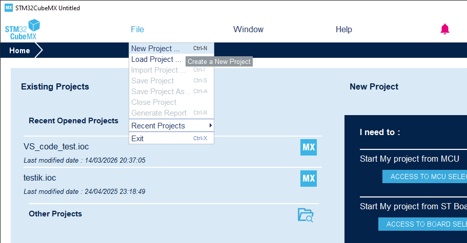
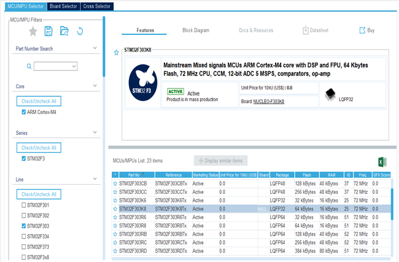
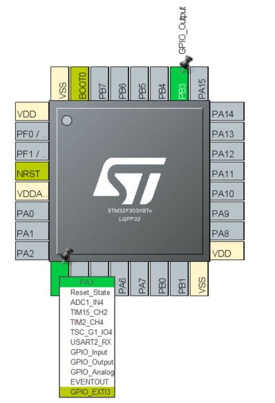
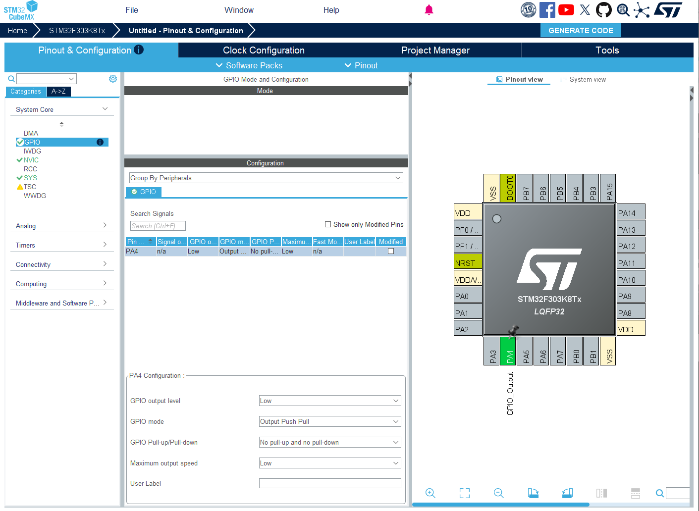
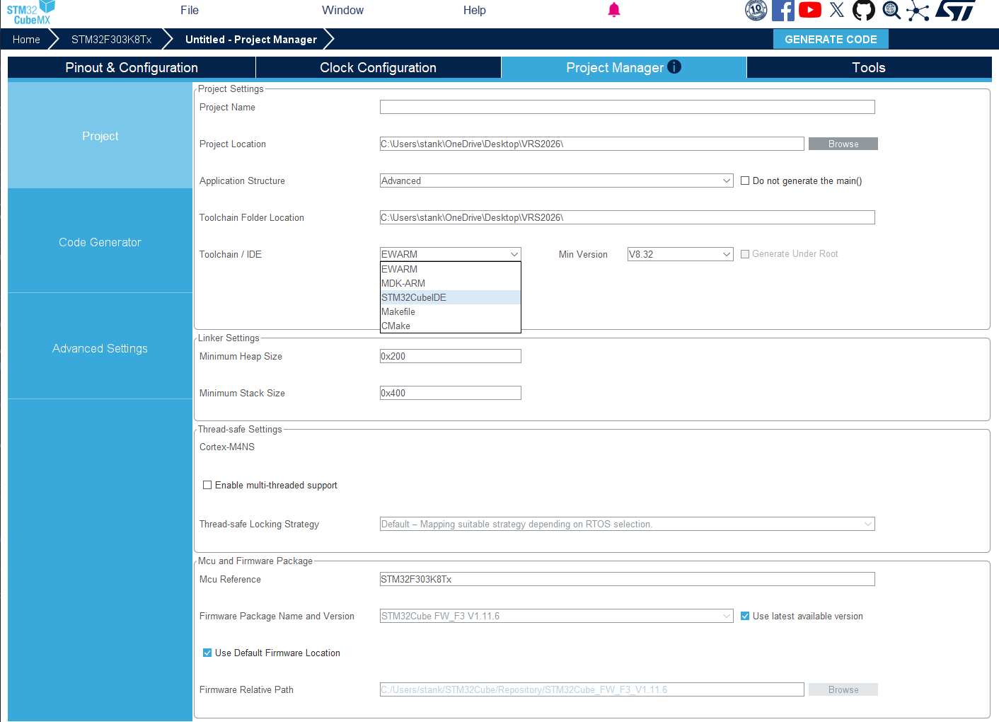
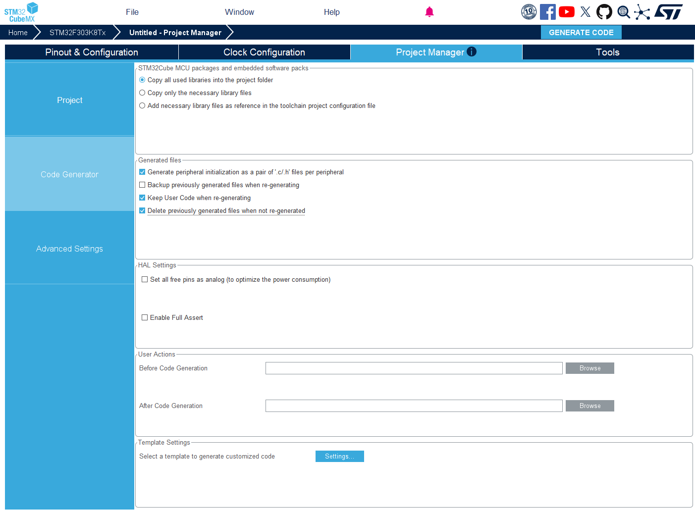
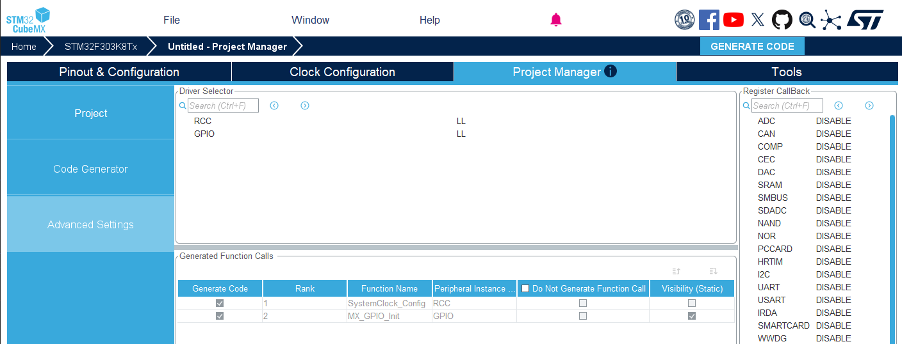
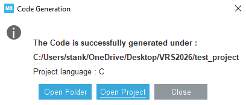

# Náplň cvičenia
- vytvorenie nového projektu v samostatnom nástroji STM32CubeMX a jeho otvorenie v STM32CubeIDE
- zoznámenie sa s prerušeniami - NVIC
- konfigurácia externých prerušení od GPIO s EXTI
- oboznámenie sa a pracovanie na zadaní 3

# Vytvorenie projektu v STM32CubeMX
- STM32CubeMX už nie je súčasťou STM32CubeIDE, je to samostatná aplikácia. V CubeMX sa projekt vytvorí, nakonfiguruje a vygeneruje, v CubeIDE sa potom program píše, kompiluje a ladí.
- v ceste k priečinku, kde vytvárame projekt, nesmie byť diakritika ani medzery (môže to spôsobovať problémy)!

### 1. vytvorenie nového projektu

- po spustení CubeMX zvolíme na úvodnej obrazovke v sekcii "New Project" možnosť "Start My project from MCU" -> "Access to MCU Selector" (alebo cez menu "File -> New Project...")

    

### 2. zvolenie typu MCU, ktorý chceme programovať (STM32F303K8)

- do poľa "Commercial Part Number" napíšeme "STM32F303K8", v zozname vpravo dole označíme náš MCU a stlačíme "Start Project"

    

### 3. konfigurácia periférií MCU (záložka "Pinout & Configuration")

- kliknutím na pin v náhľade púzdra nastavíme jeho funkciu GPIO (napr. GPIO_Input, GPIO_Output, GPIO_EXTIx) alebo ho priradíme k periférii (podľa potreby)

    

- konfigurácia konkrétnych GPIO, ktoré boli zvolené v predošlom kroku ("System Core -> GPIO")

    

- v nastaveniach hodín (záložka "Clock Configuration") nie je nutná žiadna zmena, pretože nám stačí počiatočná konfigurácia

### 4. nastavenie projektu (záložka "Project Manager -> Project")

- "Project Name" - názov projektu
- "Project Location" - priečinok, kde sa projekt vytvorí (bez diakritiky a medzier!)
- "Toolchain / IDE" - zvolíme **STM32CubeIDE**
- všetko ostatné je už dobre nastavené od začiatku

    

### 5. nastavenia súvisiace s generovaním kódu

- nastavenia, ktoré chceme nastaviť ešte pred samotným generovaním kódu

- v "Project Manager -> Code Generator" zaškrtneme "Generate peripheral initialization as a pair of '.c/.h' files per peripheral", aby bol pre každú použitú perifériu vygenerovaný ".c" a ".h" súbor

    

- v "Project Manager -> Advanced Settings" zvolíme pre všetky periférie v časti "Driver Selector" knižnicu "LL - low level" namiesto "HAL"

    

### 6. generovanie kódu

- konfiguráciu uložíme ("File -> Save Project", vytvorí sa súbor ".ioc") a stlačíme tlačidlo "GENERATE CODE" vpravo hore

    

### 7. otvorenie projektu v STM32CubeIDE

- po vygenerovaní ponúkne CubeMX dialóg s tlačidlom "Open Project", ktoré projekt otvorí v CubeIDE
- prípadne v CubeIDE cez "File -> Import... -> General -> Existing Projects into Workspace" vyberieme priečinok vygenerovaného projektu

    

- ak treba konfiguráciu neskôr zmeniť, otvoríme súbor ".ioc" v CubeMX, upravíme ho, znova stlačíme "GENERATE CODE" a v CubeIDE projekt obnovíme (pravý klik na projekt -> "Refresh" alebo F5)
- vlastný kód píšeme iba medzi komentáre `/* USER CODE BEGIN ... */` a `/* USER CODE END ... */`, inak ho nové generovanie prepíše

# Prerušenia
- "prerušenie" preruší vykonávania hlavnej slučky programu a vykoná sa fukcia, obsluha prerušenia, po ktorej vykonaní bude pokračovať beh hlavnej slučky programu

- ak nastane viacero prerušení, začne sa vykonávať prerušenie s najvyššou prioritou

- v MCU s ARM architektúrou má prerušenia na starosť NVIC

### NVIC - Nested Vector Interrupt Controller (stm32F303K8)
- 16 programovateľných úrovní priority prerušenia (4 bity)

    

- 76 maskovateľných vektorov prerušení

    

- tabulka vektorov prerušení a ich obsluha je definovaná v súbore "startup_stm32f303x8.s"

# Zadanie 3 (2b)
- Nakonfigurujte MCU tak, aby tlačidlo pripojené ku vstupnému GPIO pinu (GPIOA-3) bolo zdrojom externého prerušenia a LED pripojená ku výstupnému GPIO pinu (GPIOA-4) zmenila svoj stav po každom stlačení tlačidla. Schéma zapojenia je totožná so schémou z predchádzajúceho zadania. 

### Úlohy
- Vytvoriť vlastný projekt s využitím grafického rozhrania CubeMX.
- Nakonfigurovať periférie MCU podľa potrieb tohto zadania (input/output/interrupt) (**0.5 bodu**).
- V obsluhe prerušenia implementovať "debounce", aby sa predišlo falošnej detekcii (zo zadania 2) (**1 bod**).
- Po úspešnom detegovaní nábežnej/dobežnej hrany zmeniť stav LED (zvoľte si, ktorú hranu chcete detegovať) (**0.5 bodu**).
